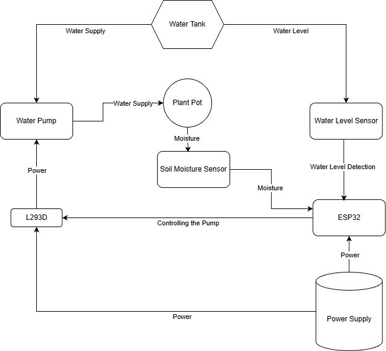
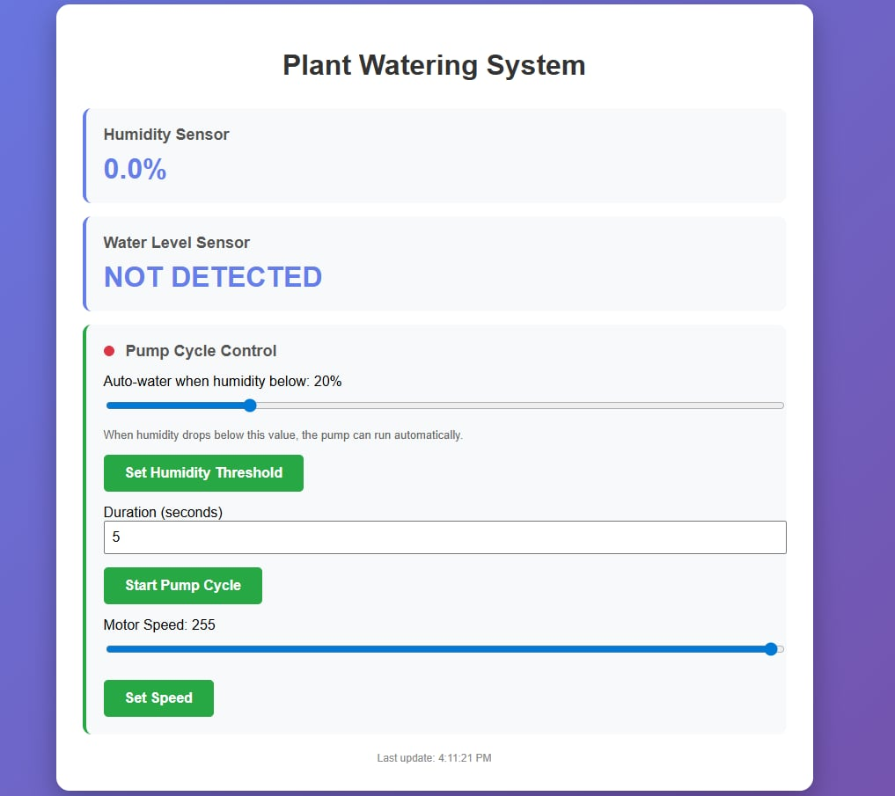

# Plant Watering System

## Components
- ESP32-based MCU (main computing unit)
- Soil Moisture Sensor
- Water Pump (+L293D motor driver)
- Contactless Water Level Sensor (XKC-Y25-V)
- Power Supply Module (for voltage regulator and USB port), Breadboard (solderless PCB alternative), wires, powerbank (4x1.5V AA batteries or any other external power source with an output voltage of 3-6V could be used as well)

## Software Libraries

We use Arduino Core libraries:

- Wifi
- WebServer
- ESPmDNS

## Scheme

## UI

## Functionality

Upon starting the MCU, the interface will be accessible at http://plant-watering.local/. It supports:
- Manual watering cycle activation
- Setting pump speed
- Showing water level and moisture status
